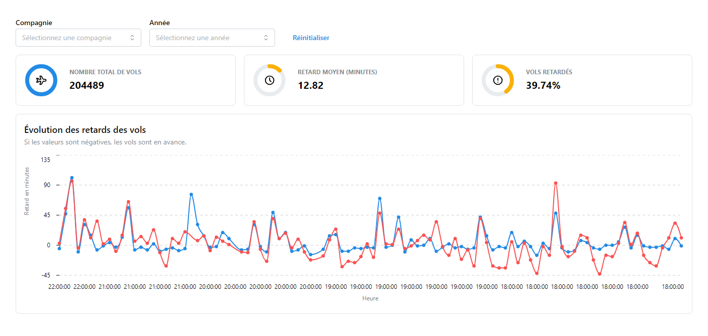

### Flights Dashboard

Pour visualiser les données via la webapp, vous devez d'abord lancer l'API.<br/>
Pour se faire, ouvrez RStudio et cliquez sur "Run API" après avoir sélectionné Plumber.R dans l'explorateur de fichier.

Une fois ceci fait, lancez votre terminal et installez les dépendances de la web app :

```sh
pnpm install
```

Et pour finir, vous pouvez lancer le front en utilisant la commande suivante :

```sh
pnpm run dev
```

Rendez-vous sur http://localhost:5173 and voilà!

### Screenshot


